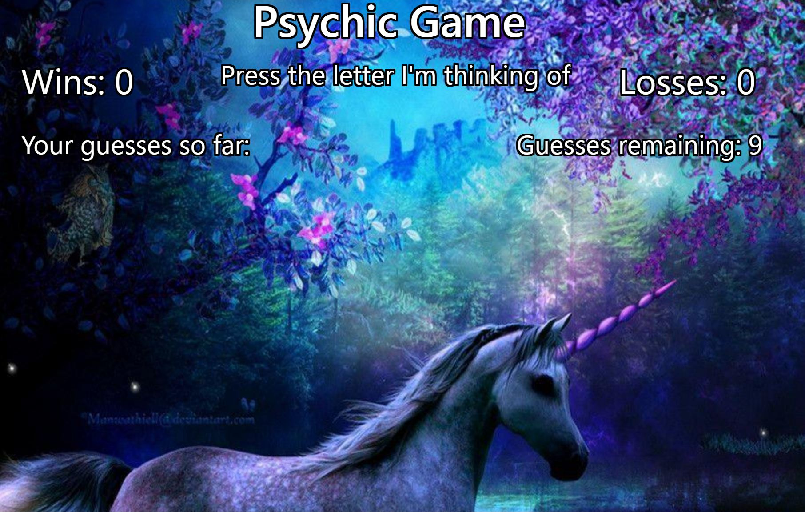

# Psychic-Game
This is a front end web application built with Bootstrap & JavaScript.

# How to use
Guess the letter the psychic is thinking of within 9 chances by pressing a different letter each time on your keyboard.  If you guess correctly, your wins increase by 1, and the game begins the next round.  If the psychic wins, your losses increase by 1, and the game also begins the next round.

# Future enhancements
Limit registered key presses to letters only

### [Go To:](https://Edestiny7.github.io/Psychic-Game/)

Technology: HTML5 | CSS3 | Bootstrap | JavaScript | Google Fonts